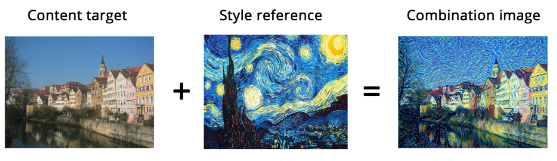

# NeuralStyleTransfer

## Introduction
When it comes to tasks like object recognition and detection, the performance of deep neural networks has already surpassed that of humans. Using machine learning techniques to create art of higher quality is essential for achieving human-like capabilities and opens up new possibilities. Additionally, deep learning is currently being applied to the creation of art, thanks to the development of computer hardware and the proliferation of the technique.
Can we use artificial intelligence to support human creativity and discovery? Through this project we want to see how style transfer can be applied on an image using AI as a tool?

## Background Work
Neural Style Transfer is an algorithm can separate and recombine the image content and style of natural images. The algorithm produces a new images of high quality that combine the content image with the style image

